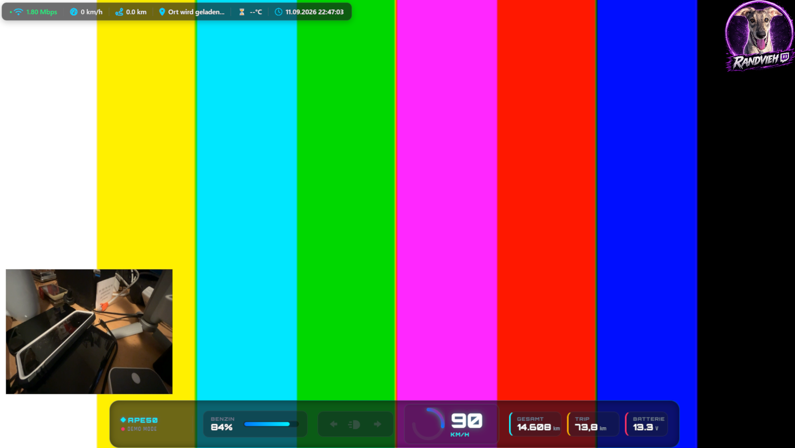
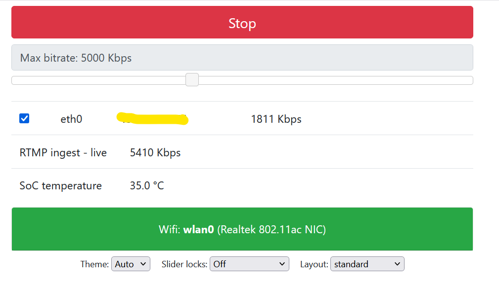

# BELABOX RTMP PiP Pipeline (`h265_camlink_1080p30_rtmp_pip`)

A custom hardware-accelerated pipeline for **BELABOX (NVIDIA Jetson)** that receives an incoming RTMP stream and overlays it as a Picture-in-Picture (PiP) window directly over your primary camera feed (e.g., Cam Link at 1080p30).




## 🚀 Features

* **Live RTMP Overlay:** Ingests a secondary stream sent to BELABOX and renders it as a Picture-in-Picture box over your main camera feed.
* **Hardware Accelerated:** Uses Jetson-native elements (`nvcompositor`, `nvv4l2decoder`, `nvv4l2h265enc`) for minimum latency and optimal performance.
* **Layout Specs:**
  * **Primary Video:** 1920x1080 @ 30 FPS (Cam Link / capture card)
  * **PiP Overlay Video:** 400x300 pixels positioned at `X=20, Y=650`
  * **Encoder:** H.265 / HEVC

## 🛠️ Installation

1. Connect to your BELABOX via SSH.
2. Create or copy the pipeline script into the Jetson pipelines folder:
   ```bash
   sudo nano /usr/share/belacoder/pipelines/jetson/h265_camlink_1080p30_rtmp_pip
   ```
3. Paste the contents of the [Pipeline Script](#-pipeline-script) section below into the file and save it (`Ctrl+O`, `Enter`, then `Ctrl+X`).
4. Reboot your BELABOX:
   ```bash
   sudo reboot
   ```

## 💻 Usage Guide

1. **Connect Primary Source:** Connect your main video camera to the BELABOX capture card as usual.
2. **Send Secondary Stream:** Broadcast your second video source (e.g., from a phone using Larix Broadcaster, or OBS) to the BELABOX RTMP ingest URL:
   ```text
   rtmp://<IP_ADDR_BELABOX>/publish/live
   ```
3. **Select Pipeline in Web UI:** Open the BELABOX Web UI and select the new encoder:
   ```text
   jetson/h265_camlink_1080p30_rtmp_pip
   ```
4. **Start Stream:** Click **Start** in the BELABOX UI. The incoming RTMP stream will appear as a PiP overlay over your main camera feed.

## 📄 Pipeline Script

File location: `/usr/share/belacoder/pipelines/jetson/h265_camlink_1080p30_rtmp_pip`

```gstreamer
v4l2src ! identity name=ptsfixup signal-handoffs=TRUE ! identity drop-buffer-flags=GST_BUFFER_FLAG_DROPPABLE !
identity name=v_delay signal-handoffs=TRUE !
videorate ! video/x-raw,framerate=30/1 !
textoverlay text='' valignment=top halignment=right font-desc="Monospace, 5" name=overlay ! queue !
nvvidconv interpolation-method=5 ! video/x-raw(memory:NVMM),width=1920,height=1080 ! comp.sink_0

rtmpsrc location=rtmp://127.0.0.1/publish/live ! flvdemux name=demux

demux.video ! queue max-size-time=2000000000 max-size-buffers=60 leaky=downstream !
h264parse ! nvv4l2decoder !
nvvidconv interpolation-method=5 ! video/x-raw(memory:NVMM),width=400,height=300 ! comp.sink_1

demux.audio ! queue leaky=downstream max-size-buffers=10 ! fakesink async=false

nvcompositor name=comp
sink_0::xpos=0 sink_0::ypos=0 sink_0::width=1920 sink_0::height=1080
sink_1::xpos=20 sink_1::ypos=650 sink_1::width=400 sink_1::height=300 !
video/x-raw(memory:NVMM),width=1920,height=1080 !
nvvidconv interpolation-method=5 ! video/x-raw(memory:NVMM),width=1920,height=1080 !
nvv4l2h265enc control-rate=1 qp-range="28,50:0,36:0,50" iframeinterval=60 preset-level=4 maxperf-enable=true EnableTwopassCBR=true insert-sps-pps=true name=venc_bps !
h265parse config-interval=-1 ! queue max-size-time=10000000000 max-size-buffers=1000 max-size-bytes=41943040 ! mux.

alsasrc device=hw:2 ! identity name=a_delay signal-handoffs=TRUE ! volume volume=1.0 !
audioconvert ! voaacenc bitrate=128000 ! aacparse ! queue max-size-time=10000000000 max-size-buffers=1000 ! mux.

mpegtsmux name=mux !
appsink name=appsink
```

## 📜 License

This project is licensed under the **MIT License**.

## 📬 Contact & Support

**Marc-Oliver Blumenauer**

📧 Email: [marc@l3c.de](mailto:marc@l3c.de) 

[](https://ko-fi.com/randvieh)
